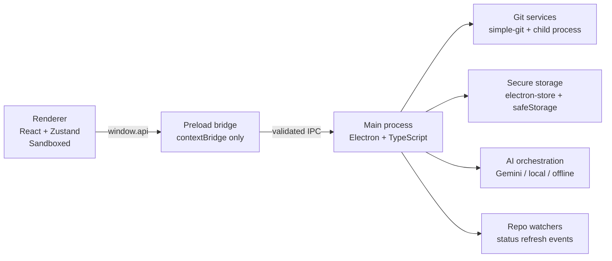

# Architecture Overview

GitSwitch follows a security-first Electron architecture: the renderer is treated as untrusted UI, the preload layer exposes a minimal typed bridge, and the main process owns every filesystem, git, network, and secret operation.

## System Diagram

## Runtime Boundaries

### Renderer: `src/renderer/src`

- Renders the application shell, repository sidebar, diff views, settings, and pull-request flows.
- Stores UI state in Zustand.
- Never touches the filesystem, shell, git, or decrypted secrets directly.

### Preload: `src/preload`

- Exposes the `window.api` surface.
- Translates renderer intent into specific IPC calls.
- Keeps the renderer contract typed and narrow.

### Main: `src/main`

- Owns all privileged work.
- Validates IPC inputs before dispatch.
- Executes git operations, manages pull requests, persists settings, handles watchers, and stores secrets.

## Key Subsystems

### Git Services

- `src/main/git/git-service.ts` encapsulates status, diff, commit, fetch, pull, push, remotes, and `.gitignore` updates.
- SSH key material is written to temporary `0600` files only when a command requires it, then removed immediately.
- Diff responses are size-limited before crossing IPC to protect the Electron event loop and the renderer.

### Secret Management

- `src/main/secure/key-manager.ts` stores non-sensitive metadata in `electron-store`.
- Private keys and tokens are encrypted with `safeStorage` and written beneath `~/.gitswitch/keys`.
- The renderer only receives presence flags such as `hasAiKey` or `hasGitHubToken`.

### AI Commit Generation

- AI orchestration lives under `src/main/ai`.
- The current product surface supports offline generation, local LLM endpoints, and cloud Gemini models.
- Prompt input is redacted before it leaves the machine when redaction is enabled.

### Repository Watching

- `src/main/git/watcher.ts` emits repo status updates to the active window.
- The renderer combines those events with an interval-based fetch loop for remote reconciliation.

## Security Model

- `sandbox: true`, `contextIsolation: true`, `nodeIntegration: false`
- Strict production CSP and hardened external link allowlist
- Input validation on every IPC route
- No direct secret exposure to the renderer
- Repository access approval before operating on a path

## Data Flow Example

1. The renderer requests `window.api.gitCommit(repoPath, title, body)`.
2. Preload forwards the call to the `git:commit` IPC channel.
3. The main process validates the path and message payload.
4. `git-service.ts` executes the commit and returns a structured result.
5. The renderer refreshes status and diffs, then updates the UI.

## Operational Notes

- Default settings are defined in the main process and mirrored in renderer hydration to avoid stale startup values.
- Coverage and test entry points are configured with Vitest, including targeted tests for security helpers.
- Packaging metadata is maintained in `electron-builder.yml`, with macOS entitlements stored under `resources/`.
